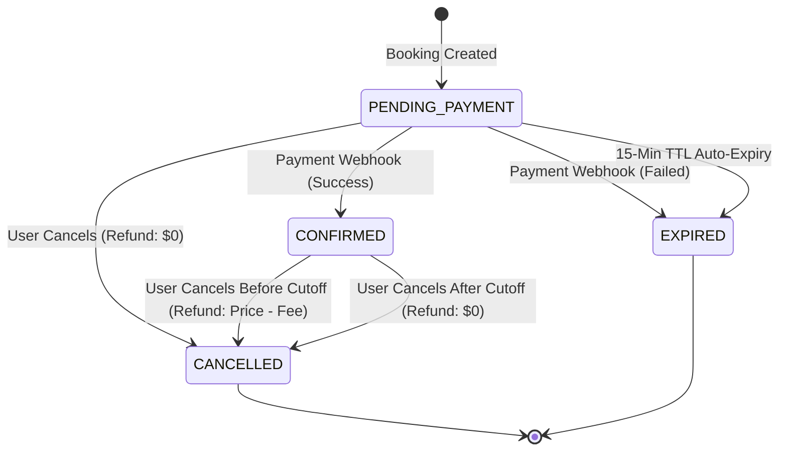

# GoTyolo Booking System: Engineering Proposal

## 1. Booking Lifecycle & State Transitions
The platform manages bookings via a deterministic state machine to ensure consistent revenue logic and seat availability.

**State Machine Diagram:**

## 2. Concurrency & Overbooking Strategy
To prevent overselling the `max_capacity` of a trip, this system implements pessimistic concurrency control at the database level. 

**Database Transactions & Lock Sequencing:**
Deadlocks commonly occur in relational databases when two concurrent processes attempt to acquire locks on the same resources in a different order (e.g., Transaction A locks `trips` then `bookings`, while Transaction B locks `bookings` then `trips`).

To guarantee deadlock-free concurrency across all endpoints (Booking, Cancellations, Webhooks, and Expiry), this API adheres strictly to a **Parent-First** lock acquisition sequence:
1.  **Read Child:** If the transaction payload only contains a `booking_id`, the system performs a standard `SELECT` (which does not block) to discover the associated `trip_id`.
2.  **Lock Parent:** Execute `SELECT ... FROM trips WHERE id = $1 FOR UPDATE`. This ensures only one process across the entire cluster can modify this trip's seat availability at any time.
3.  **Lock Child:** Execute `SELECT ... FROM bookings WHERE id = $1 FOR UPDATE`.
4.  **Execute Logic:** Perform calculations, insert/update operations.
5.  **Commit/Rollback:** The lock is automatically released.

## 3. High Traffic Scenario & Resilience
**Scenario:** A highly anticipated trip receives 500 booking requests within 5 seconds for the final 2 remaining seats.

**System Behavior under load:**
1.  **Row-Level Locking (`FOR UPDATE`):** The first request logically arrives at the database and locks the specific `trip` row. The remaining 499 requests will block at the query level, waiting for the lock to be released.
2.  **Validation:** The first two transactions will acquire the lock sequentially, observe that seats are `> 0`, deduct their seats, commit, and succeed.
3.  **Conflict Rejection:** The 3rd through 500th transactions will eventually acquire the lock, but upon checking the business constraint (`trip.available_seats < num_seats`), they will trigger an immediate rollback and return a `409 Conflict` to the user gracefully.

**Safeguards implemented:**
*   **Database connection pooling (`pg.Pool`):** Prevents maxing out PostgreSQL connections during the spike.
*   **No Application-Level Race Conditions:** By relying purely on ACID transactions, we rely on the database's native guarantee of serializability instead of trusting Node.js's event loop. 

## 4. Webhook Idempotency
Payment network glitches can result in the same "Success" webhook being fired multiple times. 
The system relies on an architectural combination of:
*   A `UNIQUE` constraint in the database for the `idempotency_key` column (where feasible).
*   A logical guard inside the `FOR UPDATE` transaction block that checks if `booking.state !== 'PENDING_PAYMENT'` or if the event ID matches the previously recorded `idempotency_key`. If true, the system skips all DB writes and returns an HTTP `200 OK` to satisfy the payment gateway.

## 5. Booking Auto-Expiry
**Mechanism:** Background Task Scheduler (NestJS `@nestjs/schedule` Cron Job).
**Frequency:** Every 1 minute.
**Strategy:**
A recurring background worker executes a continuous sweep for stale `PENDING_PAYMENT` records where `expires_at <= CURRENT_TIMESTAMP`.
To prevent scaling issues (e.g., if we run 3 instances of the backend API, we don't want 3 cron jobs fighting over the same expired bookings), the query utilizes PostgreSQL's `FOR UPDATE SKIP LOCKED`. 
This guarantees that if Worker A is currently modifying an expired row to return its seats to the trip, Worker B will skip that row entirely and move to the next expired booking, maximizing throughput without distributed lock management (like Redis implementation).

## 6. Design Justification: Denormalized Seats
The `Trip` table maintains `available_seats` as a direct integer column, rather than calculating it dynamically at read-time (e.g., `max_capacity - SUM(bookings.num_seats)`).
**Why Denormalize?**
*   **Read Performance:** The core user behavior is viewing a catalog of trips. Having readily available seat counts prevents an expensive aggregate `JOIN` scan on the bookings table for every user hitting the discovery view.
*   **Write Performance & Concurrency Risk:** Enforcing the "never overbook" rule requires checking remaining seats. A dynamic summation in a high-concurrency environment would require locking the entire table or executing complex serialization isolation levels. By denormalizing, we can apply a simple `SELECT ... FOR UPDATE` directly on the specific trip row, achieving maximum concurrency isolation.
