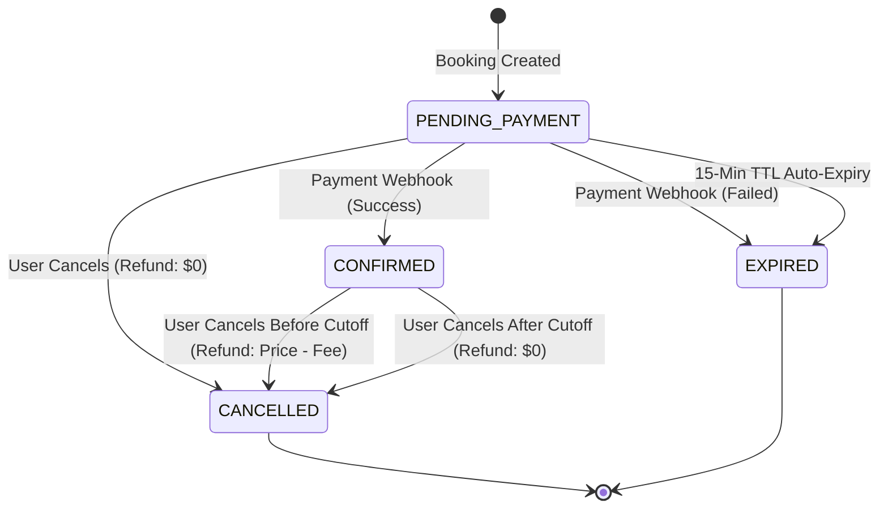

# GoTyolo Booking System: Engineering Proposal

## 1. Booking Lifecycle & State Transitions
The core of this API is built around a pretty strict state machine for bookings. This is how we make sure money logic and seat counts always stay perfectly in sync.

**State Machine Diagram:**

## 2. Concurrency & Overbooking Strategy
To make absolutely sure we never oversell a trip (even if 100 people click "Book" at the exact same millisecond), I went with pessimistic concurrency control right at the database layer.

**Database Transactions & Lock Sequencing:**
One of the biggest headaches in distributed systems is deadlocks—usually caused when two different background jobs grab locks in different orders (like Job A locking `trips` then `bookings`, but Job B locking `bookings` then `trips`).

To avoid that entirely, every single critical action (booking, cancelling, webhooks) strictly follows a "Parent-First" locking order:
1.  **Read Child First (No Lock):** If we only have a `booking_id`, we do a quick regular `SELECT` to find the `trip_id`.
2.  **Lock the Parent:** We hit the DB with `SELECT ... FROM trips WHERE id = $1 FOR UPDATE`. This grabs an exclusive row lock on the trip, meaning no other process anywhere can touch this trip's seat count until we are done.
3.  **Lock the Child:** Then we do `SELECT ... FROM bookings WHERE id = $1 FOR UPDATE`.
4.  **Do the Math:** Check constraints, calculate refunds, update rows.
5.  **Commit:** Everything saves, and Postgres automatically releases our locks.

## 3. High Traffic Scenario & Resilience
**Scenario:** A trip is super popular, and 500 people try to book the last 2 seats within 5 seconds.

**What happens under the hood:**
1.  **The Traffic Jam:** The very first request reaches the database and locks the trip row with `FOR UPDATE`. The other 499 requests don't crash or fail immediately; they actually just pause and form a queue waiting for that row lock to free up.
2.  **The Winners:** The first two transactions get their turn, see that `available_seats > 0`, deduct their seats, commit, and send a success response.
3.  **The Losers:** The 3rd through 500th transactions eventually get the lock, but when they check our business logic (`trip.available_seats < num_seats`), it fails. The transaction rolls back cleanly, and we return a `409 Conflict` to those users letting them know they missed out.

**Safeguards I put in place:**
*   **Connection Pooling (`pg.Pool`):** This stops the app from opening 500 simultaneous connections to Postgres and crashing the database.
*   **Pessimistic Row Level Locking:** Node.js event loops are great, but for money and inventory, throwing actual database constraints and row-locks at the problem is the only way to sleep well at night.

## 4. Webhook Idempotency
Payment providers like Stripe are awesome, but networks aren't perfect. They might accidentally send us the same "Payment Success" webhook twice.

To handle this gracefully:
*   We check the database to see if `booking.state !== 'PENDING_PAYMENT'`, or if the webhook's `idempotency_key` matches the one we already saved.
*   If we've already processed it, we just roll back the current transaction and send back a `200 OK`. It's super important we send a 200, otherwise the payment provider will think our server is broken and keep retrying the webhook for days.

## 5. Booking Auto-Expiry
**Mechanism:** A background Cron Job using NestJS `@nestjs/schedule`.
**Frequency:** Runs every 60 seconds.

**How it works:**
Every minute, the worker sweeps the database looking for `PENDING_PAYMENT` bookings that have crossed their `expires_at` timestamp.
It fires off a single aggressive SQL query using `UPDATE ... RETURNING` to flip them all to `EXPIRED` at once. This avoids pulling every record into Node.js memory just to check its state. The database gives us back the exact IDs and seat counts of the newly expired bookings, allowing us to safely loop through and restore the `available_seats` in the `trips` table.

## 6. Design Justification: Denormalized Seats
You'll notice the `Trip` table has an actual `available_seats` integer column, rather than making us calculate it on the fly by summing up all the confirmed bookings (`max_capacity - SUM(num_seats)`).

**Why I denormalized it:**
*   **Extremely Fast Reads:** The most common action users take is scrolling through the catalog. If we had to dynamically calculate the sum of bookings for every trip on a dashboard, the database would crawl to a halt under load.
*   **Easier Concurrency:** To enforce the rules, we have to know exactly how many seats are left. By storing it as a hard number on the trip row, we can just grab an exclusive lock on that single trip row and do our validations instantly. Having to lock multiple joined tables just to figure out capacity introduces massive deadlock risks.
